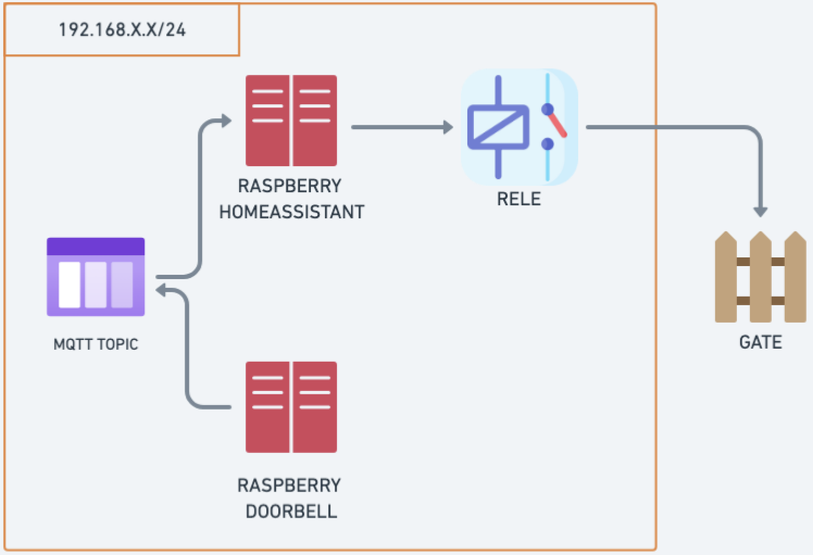
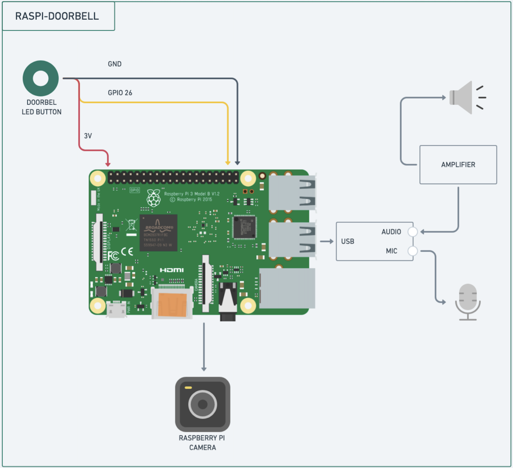
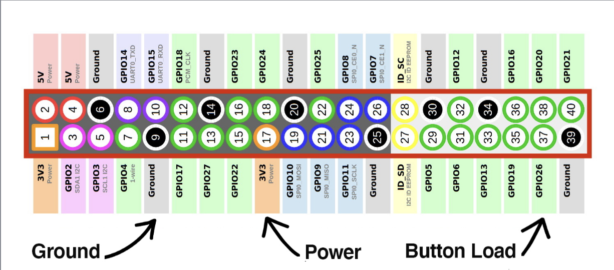

# RaspiDoorbell 

In this project I have built a simple smart doorbell using RasperryPi and some lines of code.

## Prerequisites ##

- Raspberry 3B+ Doorbell
- Raspberry 4 HomeAssistant Server 
- Momentary Button (https://shorturl.at/CYKT4)
- USB DAC (https://shorturl.at/Em8Dx)
- AUX Cable (https://tinyurl.com/y87hfb5e)
- Speaker (https://tinyurl.com/3t54tbh9)
- Amplifier (https://tinyurl.com/4y54aunx)
- Mic AUX (https://tinyurl.com/rkjptbh5)

The smart doorbell powered by Raspberry Pi opens a VOIP connection for guests when they press a button. The smart doorbell communicates with a cloud-based VOIP switchboard (Linphone - https://subscribe.linphone.org/register/email). Through a SIP client installed on any device (Linphone App) it will be possible to communicate directly with the guest by viewing him through a camera and if necessary open the gate.

## Architecture ## 

RaspiDoorbell when establishing a VOIP connection records DTMF and writes to an MQTT topic by connecting to a server (HomeAssistant). The HomeAssistant device via a plug-in reads from the topic and acts on the connected relay to open the gate.

## RaspiDoorbell ## 

## RaspiDoorbell - Connections ##

## HomeAssistant - Prerequisites ## 

Installed following addons: 

- MQTT-IO (https://github.com/hassio-addons/addon-mqtt-io) 
- MQTT SERVER (https://www.home-assistant.io/integrations/mqtt/) 
- HACS (https://www.hacs.xyz/docs/use/download/download/)

Tip: Use the HomeAssistant OS 11.2 or 11.5 cause recent version have some issues with MQTT-IO addons. 

## HomeAssistant - Install OS ## 

- Follow the instructions here https://www.home-assistant.io/installation/raspberrypi 

## HomeAssistant - Ansible Configurations ## 

- Set the HomeAssistant IP_ADDRESS on the inventoy.yml file
- Set the HomeAssistant USERNAME and PASSWORD 

## Doorpi - Install OS ## 

- Install RaspiOS https://www.raspberrypi.com/software/

## Doorpi - Ansible Configurations ## 

- Set the Doorpi IP_ADDRESS on the inventoy.yml file
- Set the SIP (Linphone) USERNAME and PASSWORD 

## Playbook ## 

- Run ansible-playbook -i inventory.yml playbook/main.yaml